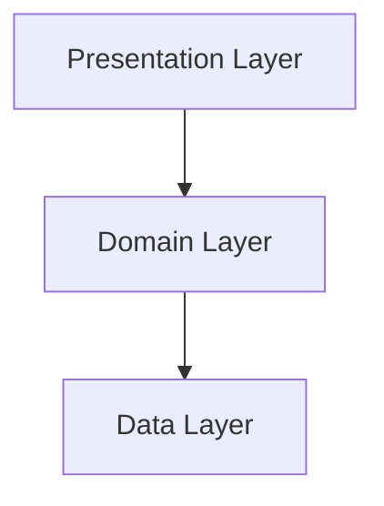

# Architecture & Technical Design

**Voice AI Chat: AI Assistant** is engineered using a robust **Clean Architecture** approach to ensure scalability, maintainability, and testability. This document outlines the architectural decisions, folder structure, and key technologies used in the project.

---

## 🏗️ Architectural Overview

The project follows the **Clean Architecture** principles, strictly separating the codebase into three main layers:

1.  **Presentation Layer**: Handles UI and State Management.
2.  **Domain Layer**: Contains Business Logic (Entities & Use Cases).
3.  **Data Layer**: Manages Data Sources (API, Local Storage) and Repository Implementations.


### Dependency Rule
**Presentation** → **Domain** → **Data**
*(Dependencies point inwards. The Domain layer is independent of other layers.)*



---

## 📂 Project Structure

```
lib/
 ├── core/                  # Core functionality shared across features
 │   ├── error/             # Centralized error handling (Failures, Exceptions)
 │   ├── network/           # Network clients (Dio) & interceptors
 │   ├── di/                # Dependency Injection setup (GetIt)
 │   ├── theme/             # App theme, colors, and text styles
 │   ├── utils/             # Utility classes and extensions
 │   └── constants/         # App implementation constants
 │
 ├── features/              # Feature-based modules
 │   ├── voice_chat/        # Feature: Voice Chat & AI Interaction
 │   │   ├── presentation/  # UI Views, Widgets, BLoCs
 │   │   ├── domain/        # Entities, UseCases, key abstractions
 │   │   └── data/          # Models, Repositories, DataSources
 │   │
 │   ├── settings/          # Feature: App Settings & Configuration
 │   │   ├── presentation/
 │   │   ├── domain/
 │   │   └── data/
 │   │
 │   └── ...                # Other features
 │
 └── main.dart              # Application entry point
```

---

## 🛠️ Key Technologies

-   **State Management**: `flutter_bloc`
    -   Used for managing complex state and business logic.
    -   Ensures separation of UI from logic.
-   **Dependency Injection**: `get_it` & `injectable`
    -   Facilitates testability and loose coupling.
-   **Networking**: `dio`
    -   Robust HTTP client for API interactions.
    -   Includes interceptors for logging and error handling.
-   **Routing**: `go_router`
    -   Declarative routing solution for deep linking and navigation.
-   **Local Storage**: `hive` / `shared_preferences`
    -   Offline caching and user preferences.
-   **Voice processing**: `speech_to_text`, `flutter_tts`
    -   Core packages for voice interactions.

---

## 🔄 Data Flow

1.  **UI Event**: User interacts with the UI (e.g., presses the microphone button).
2.  **BLoC**: The event is dispatched to the corresponding BLoC.
3.  **UseCase**: BLoC executes a specific UseCase (e.g., `SendMessageUseCase`).
4.  **Repository**: UseCase calls the abstract Repository.
5.  **DataSource**: Repository implementation calls the Remote (API) or Local (Cache) Data Source.
6.  **Response**: Data is returned up the chain, mapped to Domain Entities, and result is emitted as a new State to the UI.

---

## ✅ Testing Strategy

-   **Unit Tests**: Validate business logic in UseCases and Repositories.
-   **Widget Tests**: Ensure UI components render and behave correctly.
-   **Integration Tests**: Verify complete user flows from UI to Data.

---

## 🔒 Security & Performance

-   **Secure Storage**: Sensitive data (tokens) stored securely.
-   **Performance Optimization**: Lazy loading of modules and efficient asset management.
-   **Error Handling**: Centralized error handling using `dartz` (Either type) to manage failures gracefully without crashing the app.
