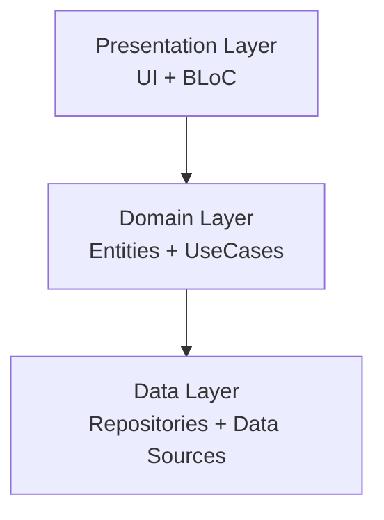

# Voice AI Chat: AI Assistant

**Revolutionary AI-Powered Communication & Voice Transformation**

Introducing **Voice AI Chat: AI Assistant** – a revolutionary approach to interactive communication. Harness the power of artificial intelligence right on your smartphone, chat using your voice, and get instant, accurate responses. All your dialogues are saved, enabling you to return and reference them at any time.

---

## 🚀 Key Features

Engage with our AI not just in casual chat, but also to achieve various tasks:

- **📍 Compose Tales, Poems & Scripts**: Let your creativity flourish with the AI's assistance in crafting captivating narratives, beautiful poems, or intriguing scripts.
- **📍 Create Content**: Looking for unique ideas for your content? Our AI can help generate original and engaging material.
- **📍 Answer Questions**: Need to fact-check or find quick answers? Ask our AI, capable of providing reliable information promptly.
- **📍 Translate Text**: Communicate globally with our AI's ability to translate any text into the language you need.
- **📍 Assist in Learning**: Improve your knowledge and skills with the AI's help, offering a personalized learning experience.
- **📍 Assist in Planning**: Streamline your tasks and schedule with our AI assistant, designed to aid in your daily planning.
- **📍 Provide Recommendations**: Discover new interests as the AI suggests books, movies, and music based on your preferences.
- **📍 Play & Have Fun**: Enjoy some downtime with our AI, which can engage you in games and entertaining conversations.
- **📍 Discuss Philosophical Topics**: Delve into deep discussions with our AI, capable of stimulating dialogue on a wide range of philosophical topics.

---

---

## 🛠 Technical Architecture

This project is built with a **Clean Architecture** approach using Flutter, ensuring scalability, testability, and maintainability.

- **State Management**: `flutter_bloc`
- **Dependency Injection**: `get_it`
- **Navigation**: `go_router`
- **Networking**: `dio`

- **Local Storage**: `hive`

### Architecture Diagram

For detailed technical documentation, please refer to [ARCHITECTURE.md](ARCHITECTURE.md).

---

## 📥 Download

**Voice AI Chat: AI Assistant** is designed for everyone and anyone seeking a futuristic, efficient, and fun way to communicate.

Download now and step into a new era of AI-powered conversation!

[Download on Google Play](https://play.google.com/store/apps/details?id=com.aiway.voiceai)
[Download on App Store](https://apps.apple.com/us/app/voice-ai-chat-ai-assistant/id6450684090)

---

---

## 📄 License

Copyright &copy; 2024 AI Way. All rights reserved.
