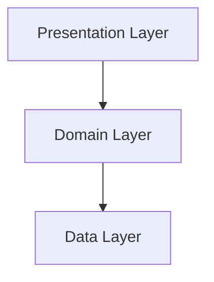

# 

**Senior Flutter Engineer | Clean Architecture | Enterprise Refactoring Specialist**
Flutter | BLoC | Dio | Firebase | Stripe | Scalable Systems

---

## 🔗 GITHUB PORTFOLIO

**GitHub**: [Link to Portfolio]

The repository contains production-level Flutter projects implementing:
- **Feature-first Clean Architecture**
- **flutter_bloc state management**
- **Dio-based API integration**
- **Firebase integrations**
- **Stripe payments**
- **Offline-first implementations**
- **Unit, widget, and integration tests**

All projects follow strict architectural boundaries and enterprise-grade structure.

---

## 🧠 ENGINEERING MINDSET

I architect systems to:
- **Scale across teams**
- **Survive long-term maintenance**
- **Enforce strict separation of concerns**
- **Eliminate architectural debt**
- **Standardize state management**
- **Centralize failure handling**
- **Enforce responsive and theme systems**

Every project is structured as a long-term maintainable enterprise product.

---

## 1. CODE SAMPLES AND APPLICATION ARCHITECTURE

### 1.1 State Management
**Primary standard**: `flutter_bloc`
- **Bloc** handles complex business logic
- **Cubit** handles simple state flows
- **UI** contains zero business logic
- **No API calls** inside UI
- **No data mapping** inside UI

**Example**:
```dart
class LoginBloc extends Bloc<LoginEvent, LoginState> {
  final LoginUseCase loginUseCase;

  LoginBloc(this.loginUseCase) : super(LoginInitial()) {
    on<LoginRequested>((event, emit) async {
      emit(LoginLoading());

      final result = await loginUseCase(event.email, event.password);

      result.fold(
        (failure) => emit(LoginFailure(failure.message)),
        (user) => emit(LoginSuccess(user)),
      );
    });
  }
}
```

### 1.2 Custom UI Components
Reusable widget system: `AppButton`, `AppText`, `AppInputField`, `AppScaffold`, `AppLoader`, `AppErrorView`.

**Example**:
```dart
class AppButton extends StatelessWidget {
  final String label;
  final VoidCallback onPressed;

  const AppButton({
    required this.label,
    required this.onPressed,
  });

  @override
  Widget build(BuildContext context) {
    return ElevatedButton(
      style: ElevatedButton.styleFrom(
        backgroundColor: AppColors.primary,
      ),
      onPressed: onPressed,
      child: Text(label, style: AppTextStyles.body),
    );
  }
}
```
All widgets are theme-aware and responsive.

### 1.3 API Integration and Data Handling
Centralized Dio client using `DioClient` with interceptors.Repository implementation handles mapping and error handling using `dartz`.

**Example**:
```dart
class AuthRepositoryImpl implements AuthRepository {
  final Dio dio;

  AuthRepositoryImpl(this.dio);

  @override
  Future<Either<Failure, User>> login(String email, String password) async {
    try {
      final response = await dio.post(
        "/login",
        data: {"email": email, "password": password},
      );
      return Right(UserModel.fromJson(response.data));
    } on DioException catch (e) {
      return Left(DioErrorMapper.map(e));
    }
  }
}
```

### 1.4 Offline-First Functionality
- **Firebase persistence**: Enabled by default.
- **REST-based caching**: Local storage layer using Hive or SharedPreferences, repository-level fallback logic, retry mechanism on connectivity restoration.

---

## 2. UI AND UX IMPLEMENTATION

### 2.1 Implemented Designs
Live UI examples available in **Wholesale EZ** and **Jobs Shopper**. Features include:
- Pixel-perfect implementation
- Dark and light theme switching
- Tablet responsiveness
- Centralized theme system

### 2.2 Custom Animations
Example page transition using `PageRouteBuilder` and `FadeTransition`.

### 2.3 Accessibility Features
Semantic widgets, scalable text support, high-contrast themes, screen reader compatibility.

---

## 3. ARCHITECTURE AND DESIGN PATTERNS

### 3.1 Clean Architecture (Feature-First)
**Structure**:
```
lib/
 ├── core/
 ├── features/
 │    └── feature_name/
 │         ├── presentation/
 │         ├── domain/
 │         └── data/
```

**Dependency flow**: Presentation → Domain → Data (Dependency direction is never reversed).



### 3.2 Dependency Injection
Using `get_it` for dependency injection. Constructor injection only, fully testable architecture.

### 3.3 Navigation Pattern
Centralized route management, named routes, guard-based redirection.

### 3.4 Error Handling Strategy
Centralized `Failure` abstraction mapped from Dio exceptions. The UI layer never receives raw exceptions or HTTP codes.

---

## 4. CODE QUALITY EVIDENCE

### 4.1 Unit Tests (Business Logic)
Tests validating business logic using mocked repositories.

### 4.2 Widget Tests
Tests verifying UI components render and behave correctly.

### 4.3 Integration Tests
Full flow tests mocking API responses and validating state transitions.

---

## 5. PLATFORM-SPECIFIC SKILLS

### 5.1 Native Code Integration (MethodChannel)
Usage of `MethodChannel` for platform-specific features.

### 5.2 Native Plugin Usage
Experience with Camera, Location, Firebase Messaging, Stripe SDK.

### 5.3 Push Notification Setup (FCM)
Notifications handled via Bloc and never directly inside UI.

---

## SUMMARY
- Production apps on Android and iOS
- Feature-first Clean Architecture
- flutter_bloc state management
- Dio networking layer
- Centralized failure handling
- Offline-first implementation
- Fully responsive architecture
- Reusable design system
- Unit, widget, and integration testing
- Native platform integration
- Enterprise-level refactoring capability
